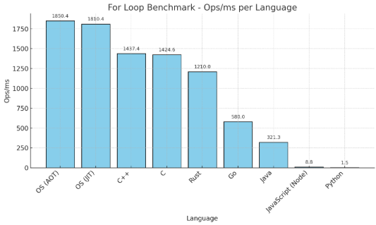

# OS Language Microbenchmark

This repository contains microbenchmark scripts to test and compare the performance of a simple `for` loop across multiple programming languages, including compiled and JIT versions of **[OS (OmniScript)](https://github.com/0m0g1/omniscript)**.

## 🔬 Benchmark Task

A single `for` loop that adds `i` to a variable `x` one billion times:

```text
x += i
```

## 🧪 Methodology

* High-resolution timers used (e.g., `QueryPerformanceCounter` on Windows).
* Warmup loops stabilize CPU frequency and cache behavior.
* Final values are printed to prevent dead code elimination.
* Measured in **milliseconds** with results reported as **Ops/ms**.

## 📊 Results (Ops/ms)

| Language       | Ops/ms |
| -------------- | -----: |
| **OS (AOT)**   | 1850.4 |
| **OS (JIT)**   | 1810.4 |
| **C++**        | 1437.4 |
| **C**          | 1424.6 |
| **Rust**       | 1210.0 |
| **Go**         |  580.0 |
| **Java**       |  321.3 |
| **JavaScript** |    8.8 |
| **Python**     |    1.5 |

> ⚠️ **Note**: This is a *microbenchmark*. Real-world workloads may show very different results depending on memory, branching, I/O, etc.

## 📈 Chart



## 🚀 Usage

Clone the repository and run each benchmark using the language-specific instructions below.

Make sure you have all required compilers or runtimes installed.

### 🔧 Example (C):

```bash
gcc -O3 -o bench_c test.c
./bench_c
```

### 🛠️ Example (C++):

```bash
g++ -O3 -o bench_cpp test.cpp
./bench_cpp
```

### 🮀 Example (Rust):

```bash
rustc -C opt-level=3 -o bench_rust test.rs
./bench_rust
```

### 🌀 Example (Go):

```bash
go build -ldflags="-s -w" -o bench_go test.go
./bench_go
```

### ☕ Example (Java):

```bash
javac test.java
java test
```

### 🧠 Example (Python):

```bash
python test.py
```

### 🌐 Example (JavaScript with Node.js):

```bash
node test.js
```

### ⚡ Example (OS Language):

You'll need to build the OS compiler to compile scripts, or run them via the JIT.
For simplicity the executable is already built in the repo (bench_os.exe). 

**Repository:** [github.com/0m0g1/omniscript](https://github.com/0m0g1/omniscript)

```bash
# AOT-compiled executable (already built in this repo for demo)
./bench_os
```

> You can dump the generated assembly or IR if you want to verify what's being run.
> ```bash
> objdump -d -M intel ./bench_os.exe > bench_os.asm
> ```

## 📁 File Structure

```
benchmarks/
├── test.c
├── test.cpp
├── test.rs
├── test.go
├── test.java
├── test.py
├── test.js
├── test.os             # OS AOT and JIT source
├── bench_os.exe        # Precompiled OS binary
├── bench_c.exe         # Precompiled OS binary
├── bench_go.exe        # Precompiled OS binary
├── bench_rust.exe      # Precompiled OS binary
└── benchmark_chart.png
```

## 📜 License

MIT License
